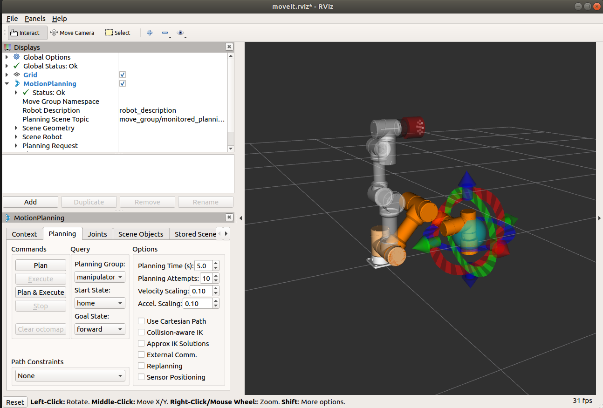
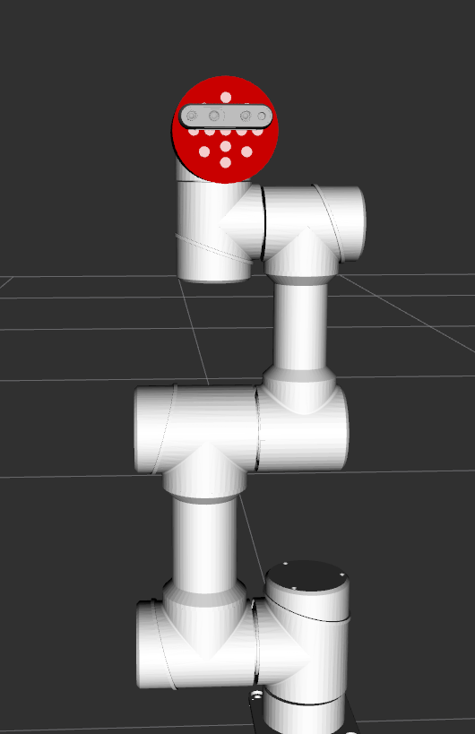
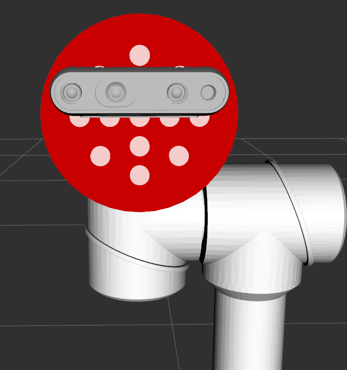
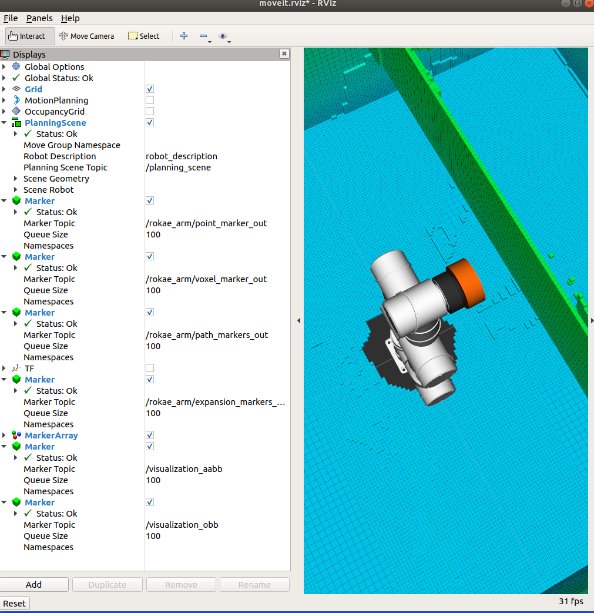
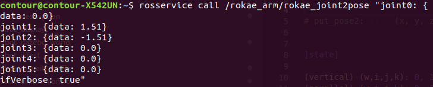
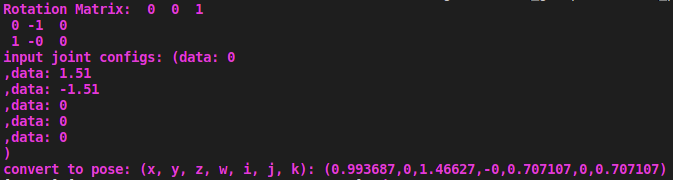
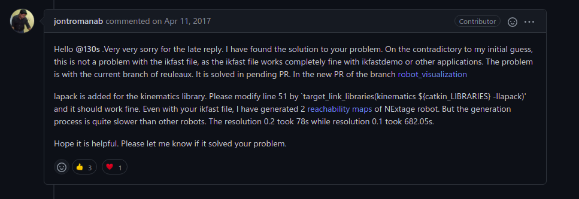

# Module Manual
This manual will introduce how to use the JPS planning module if you want to change the robot that the original project default model. You need to check the robot type to ensure satisfying `6-DOF` requirement.

- [Module Manual](#module-manual)
  - [1. robot description](#1-robot-description)
        - [USAGE](#usage)
  - [2. gazebo world](#2-gazebo-world)
        - [USAGE](#usage-1)
  - [3. IKFast](#3-ikfast)
        - [Generate .dae file](#generate-dae-file)
        - [Generate IK Solver](#generate-ik-solver)
        - [Create Plugin](#create-plugin)
  - [4.Moveit](#4moveit)
    - [moveiet_setup_assistant](#moveiet_setup_assistant)
        - [Self-Collision](#self-collision)
        - [Virtual Joints](#virtual-joints)
        - [Planning Group](#planning-group)
        - [Robot Poses](#robot-poses)
        - [End Effector](#end-effector)
        - [Passive Joints](#passive-joints)
        - [Controllers](#controllers)
        - [Author Information](#author-information)
      - [Update Solver](#update-solver)
    - [Function test](#function-test)
    - [Obstacle Padding](#obstacle-padding)
  - [5. Intel RealSense i435](#5-intel-realsense-i435)
  - [6.Rviz and Gazebo](#6rviz-and-gazebo)
      - [1. Trajectory Execution Functionality](#1-trajectory-execution-functionality)
      - [2. ros_controllers.yaml](#2-ros_controllersyaml)
      - [3. _rokae_simple_control_ package](#3-rokae_simple_control-package)
        - [1.rokae_arm_trajectory_controller.launch](#1rokae_arm_trajectory_controllerlaunch)
        - [2. rokae_arm_gazebo_states.launch](#2-rokae_arm_gazebo_stateslaunch)
        - [3.rokae_arm_gazebo_world.launch](#3rokae_arm_gazebo_worldlaunch)
        - [4.rokae_arm_toplevel_moveit.launch](#4rokae_arm_toplevel_moveitlaunch)
        - [5. moveit_planning_execution.launch](#5-moveit_planning_executionlaunch)
      - [4. elerobot_moveit_config/launch/moveit.rviz](#4-elerobot_moveit_configlaunchmoveitrviz)
      - [USAGE:](#usage-2)
        - [pid](#pid)
        - [chomp](#chomp)
  - [7. Octomap](#7-octomap)
      - [dynamicEDT3D](#dynamicedt3d)
      - [USAGE NOTE](#usage-note)
  - [8. JPS and TOPP-RA](#8-jps-and-topp-ra)
    - [TOPP-RA](#topp-ra)
    - [JPS](#jps)
      - [1. config/rokae_config_JPS.yaml](#1-configrokae_config_jpsyaml)
      - [2. include/JPS_Modules/ikfast.h](#2-includejps_modulesikfasth)
      - [3. rokae_joint2pose.cpp](#3-rokae_joint2posecpp)
      - [4. rokae_arm_manipulator_ikfast_solver.cpp](#4-rokae_arm_manipulator_ikfast_solvercpp)
      - [5. rokae_arm_eef_state.cpp](#5-rokae_arm_eef_statecpp)
      - [6. rokae_ikfast_wrapper.cpp](#6-rokae_ikfast_wrappercpp)
      - [7. rokae_arm_main.cpp](#7-rokae_arm_maincpp)
        - [Action Service](#action-service)
      - [USAGE](#usage-3)
---
## 1. robot description
You need to create your own robot description package to describe the robot that you want to use in `URDF` file. `xacro` is a macro assisting to describe the robot more efficiently.

You need to use `Solidworks` to build the 3D model of the robot, and create the `DH` model. `Solidworks` will assist to getting the robot links'interia and generate `STL` type files included in `mesh` folder. 

**[Note]:** 
- You need to take attention that the `unit` in `SolidWorks` often to be `mm`, but in `rviz` and `gazebo` often `m`. Generally we need to scale the `STL` file `0.001` times.
- When you describe the robot, make sure the `TF` using a unit that fit the resolution of your Octomap resolution, otherwise your manipulator cannot locate at the gird.

##### USAGE
I have create a ros package named `elerobot_display`. You can change the codes in the launch file corresponding to what you modified in other folders. Generally you can use `elerobot_display` to debug you robot model, building `TF` relation, improving model, adding new modules etc.
```shell
  roslaunch elerobot_display display_xacro
```

## 2. gazebo world
gazebo world is a simulated physical world. I have create the `elerobot_gazebo_world` package to help you display the gazebo world. By default, the world is empty. You can load the world you have created in `world` folder. Besides, you can display the robot you have created in `elerobot_description`. 

Bear in mind if you want to use the world out of debugging conditions, the world need to be clean without any robot you want to control.

##### USAGE
```shell
  roslaunch elerobot_gazebo_world elerobot_world.launch 
```
**[Note]:** Details are shown in the files located at `elerobot_gazebo_world` package.

## 3. IKFast

The tutorial [IKFast Kinematics Solver](http://docs.ros.org/en/melodic/api/moveit_tutorials/html/doc/ikfast/ikfast_tutorial.html) written for ROS Melodic Moveit1 will help you understand the function of IKFast and know how to install it. But you have to install the necessary modules introduced in [Master-sx](https://github.com/Master-sx)/[ROKAE-deficient-dof-manipulator](https://github.com/Master-sx/ROKAE-deficient-dof-manipulator). I just write how I create a IKFast solver for `Elephant Robot Panda P3`. 

**IKFast** will create `IKFast Solver` according to your description in `xacro` file. The initial state, the joints limitations and other elements will all be taken into consideration. Pleas check your `xacro` file again to guarantee all those parameters correct.

##### Generate .dae file
```shell
cd ~/ws_catkin_elephant && catkin_make
export MYROBOT_NAME="elerobot" # the same as the elerobot.urdf.xacro prefix
roscd elerobot_description && cd xacro
rosrun xacro xacro --inorder -o "$MYROBOT_NAME".urdf "$MYROBOT_NAME".urdf.xacro # convert `xacro` to `urdf`
rosrun collada_urdf urdf_to_collada "$MYROBOT_NAME".urdf "$MYROBOT_NAME".dae # sudo apt-get install ros-melodic-collada-urdf if "[rospack] Error: package ‘collada_urdf’ not found " occurs
openrave-robot.py "$MYROBOT_NAME".dae --info links # display the link info
```
##### Generate IK Solver
```shell
export PLANNING_GROUP="manipulator" # don't change it !!!
export BASE_LINK="0"
export EEF_LINK="8"
export BASE_LINK_NAME="world"
export EEF_LINK_NAME="elerobot_link7"
export IKFAST_OUTPUT_PATH=$HOME/ws_catkin_elephant/src/elephant/elerobot_ikfast/ikfast61_"$PLANNING_GROUP".cpp
python `openrave-config --python-dir`/openravepy/_openravepy_/ikfast.py --robot="$MYROBOT_NAME".dae --iktype=transform6d --baselink="$BASE_LINK" --eelink="$EEF_LINK" --savefile="$IKFAST_OUTPUT_PATH"
```
If the terminal output end with `store solution`, the solver is generated successfully. Otherwise, you need to check `DH model` first and then the adjust the parameters in `elerobot_description` package.

##### Create Plugin
```shell
export MOVEIT_IK_PLUGIN_PKG="$MYROBOT_NAME"_ikfast_"$PLANNING_GROUP"_plugin
cd ~/ws_catkin_elephant/src
catkin_create_pkg "$MOVEIT_IK_PLUGIN_PKG"
cd ..
catkin_make
# After you create the Moveit config package, you can run this command to update yaml file and use IKFast solver in Moveit.
rosrun moveit_kinematics create_ikfast_moveit_plugin.py "$MYROBOT_NAME" "$PLANNING_GROUP" "$MOVEIT_IK_PLUGIN_PKG" "$BASE_LINK_NAME" "$EEF_LINK_NAME" "$IKFAST_OUTPUT_PATH"
```
## 4.Moveit
This [tutorial](http://docs.ros.org/en/melodic/api/moveit_tutorials/html/doc/setup_assistant/setup_assistant_tutorial.html) will help you create the moveit config file. Don't forget to name the config file `elerobot_moveit_config`. `elerobot` is `MYROBOT_NAME` when you create the ikfast solver.

```shell
roslaunch moveit_setup_assistant setup_assistant.launch
```
### moveiet_setup_assistant

##### Self-Collision
Higher density leads to more accurate self-collision checking matrix.

##### Virtual Joints
We have set the base link name as `world`, so we don't need to set the `Virtual Joints` again. The `Moveit` will help us to do this.

##### Planning Group
- We will first add Elephant Panda arm as a planning group
  - Enter **Group Name** as `manipulator`
  - Choose `kdl_kinematics_plugin/KDLKinematicsPlugin` as the kinematics solver. We will change it to `IKFast` later. Or if you find `elerobot_manipulator/IKFastKinematicsPlugin`, you can choose it.
  - Let Kin. `Search Resolution` and `Kin. Search Timeout` stay at their default values.
- Now, click on the Add Joints button. 
  - Add `elerobot_joint` 0 to 5.
  - Click `Save`.
- We will also add a group for the end effector. NOTE that you will do this using a different procedure than adding the arm.
  - Click on the **Add Group** button.
  - Enter **Group Name** as `hand`.
  - Let Kin. `Search Resolution` and `Kin. Search Timeout` stay at their default values.
  - Click on the **Add Links** button.
  - Add `elerobot_link7`.
  - Click `Save`.
- Add the `hand` group as a `manipulator` subgroup.

##### Robot Poses
We can set several poses for debug.

##### End Effector
- Choose `hand` as the **End Effector Name** for the gripper.
- Select `hand` as the **End Effector Group**.
- Select `elerobot_link7` as the `Parent Link` for this end-effector.
- Choose `manipulator` as Parent Group.

##### Passive Joints
blank

##### Controllers
Click auto generate button.

##### Author Information
Suit yourself

#### Update Solver
If everything goes well, please enter the following command to update the solver used in `Moveit`:
```shell
rosrun moveit_kinematics create_ikfast_moveit_plugin.py "$MYROBOT_NAME" "$PLANNING_GROUP" "$MOVEIT_IK_PLUGIN_PKG" "$BASE_LINK_NAME" "$EEF_LINK_NAME" "$IKFAST_OUTPUT_PATH"
```
Then you can run `roslaunch elerobot_moveit_config demo.launch` to check if the robot be controlled successfully.
- Choose the **Planning Group:** _manipulator_
- Choose the **Start State:** _home_
- Choose the **Goal State:** _forward_ or other poses you set in `moveit_setup_assistant`.
- Click `Plan && Execute` to see whether the manipulator will execute the planning result or not. If it reach the goal successfully, congratulations! Otherwise, you need to check whether your **IK solver** worked well or if you had updated the configurations in `elerobot_moveit_config/config/kinematics.yaml`, it needs to be like this:
  ```yaml
  manipulator:
    kinematics_solver: elerobot_manipulator/IKFastKinematicsPlugin
    kinematics_solver_search_resolution: 0.005
    kinematics_solver_timeout: 0.005
  ```  


### Function test

Copy the `rokae_moveit_demo` package from `rokae` project. You can change the package name but remember change the parameters in **CMakeLists.txt** and **package.xml**. 
- delete `rokae_msgs` and change the `rokae_arm_ikfast_manipulator_plugin` to `elerobot_ikfast_manipulator_plugin` in `find_package` and `catkin_package` space in **CMakeLists.txt** and **package.xml**.
- If you change the package name, change the **<name>** in both files mentioned above.

`rosrun <PACKAGE_NAME> <TYPE_NAME>` after you have launch the `demo.launch` in moveit config file.

### Obstacle Padding

- Move `padding.yaml` to `elerobot_moveit_config/config` from `rokae` project.
- Add following codes in `elerobot_moveit_config/planning_context.launch`.
  ```xml
  <!-- Load padding -->
    <group ns="$(arg robot_description)_planning">
      <rosparam command="load" file="$(find <robot>_moveit_config)/config/padding.yaml" />
    </group>
  ```
## 5. Intel RealSense i435
Copy the `realsense_gazebo_description` and `realsense_gazebo_plugin` packages from `rokae` project. Now we need to create our sensor camera for manipulator.

- Please run `catkin_make` first to guarantee the ROS can recognize the `realsense_gazebo_description` and `realsense_gazebo_plugin` packages.
- You need to copy the following code and add them to the `<YOUR_ROBOT_DESCRIPTION>.xacro`(`elerobot.xacro`) marco space. And make sure the `with_camera` is `true` in upper file.
  ```xml
      <!-- di435  frame definition can be found at https://github.com/IntelRealSense/librealsense/blob/master/doc/d435i.md -->
      <xacro:if value="${with_camera}">
        <xacro:include filename="$(find realsense_gazebo_description)/urdf/_d435i.urdf.xacro"/>
        <xacro:sensor_d435i  parent="${arm_id}_link7" name="D435i_camera" topics_ns="D435i_camera" enable_pointCloud="true" align_depth="false">
          <origin xyz="0.0 0.0 0.0" rpy="0.0 0.0 0.0"/>
        </xacro:sensor_d435i> 
      </xacro:if>
  ```
- Use display package to ensure the camera is adjust to the appropriate position and pose.
<center>
<figure>
  
  
  
</figure>
</center>

- Now we need to make the camera work. 
  - Find `elerobot_moveit_config/config/sensors_3d.yaml` file and you will find nothing. That is appropriate. We didn't configure it when we use `moveit_setup_assistant`.
  - Copy the `rokae_arm_moveit_config/config/sensors_3d_point_cloud.yaml` content to `sensor_3d.yaml` and then we rename the `sensor_3d.yaml` to `sensors_3d_point_cloud.yaml`.
  - Next you need to find the `elerobot_moveit_config/launch/move_group.launch`. If you want to open sensor function, what you need to do is re-annotate the **Sensors Functionality** part. We can find the **Sensors Functionality** use the `sensor_manager.launch.xml` file.
  - Modified the code below **Params for the octomap monitor**:
    ```xml
      <!-- Params for the octomap monitor -->
      <param name="octomap_resolution" type="double" value="0.01" />
      <param name="octomap_frame" type="string" value="world" />
      <node pkg="octomap_server" type="octomap_server_node" name="octomap_server">
        <!-- The frame_id of the point cloud has to be the sensor frame -->
        <param name="resolution" type="double" value="0.01"/>
        
        <param name="frame_id" type="string" value="world" />
        <!-- maximum range to integrate (speedup!) -->
        <param name="sensor_model/max_range" value="3.0" />
        <param name="latch" value="false"/>
        <!-- data source to integrate (PointCloud2) -->
        <!-- <remap from="cloud_in" to="/$(arg camera_name)/depth/color/points" /> -->
        <remap from="cloud_in" to="/move_group/filter_cloud" />
        <remap from="octomap_point_cloud_centers" to="/$(arg camera_name)/octomap_point_cloud_centers"/>
      </node>
    ```
    And you need to change the 3D sensor config file name to what you have changed. In `elerobot`, these codes are:
    ```xml
    <rosparam command="load" file="$(find elerobot_moveit_config)/config/sensors_3d_point_cloud.yaml" />
    ```
    And you need to add the following codes at beginning:
    ```xml
    <arg name="camera_name" default="D435i_camera"/>
    ```

## 6.Rviz and Gazebo

In this session we will connect the **Rviz** and **Gazebo**. 
Please see the [README.md](elerobot_moveit_config/README.md) in `elerobot_moveit_config` package first and create the necessary files. But I find the new version `Moveit` modified some files name.

---
#### 1. Trajectory Execution Functionality
In `elerobot_moveit_config/launch/move_group.launch`, the **Trajectory Execution Functionality** write:
```xml
  <!-- Trajectory Execution Functionality -->
  <include ns="move_group" file="$(dirname)/trajectory_execution.launch.xml" if="$(arg allow_trajectory_execution)">
    <arg name="moveit_manage_controllers" value="true" />
    <arg name="moveit_controller_manager" value="$(arg moveit_controller_manager)" />
    <arg name="fake_execution_type" value="$(arg fake_execution_type)" />
  </include>
```
- The `moveit_controller_manager` argument becomes `simple`. 
- Next, I check the `trajectory_execution.launch.xml` file, I find that the original `<ROBOT_NAME>_moveit_controller_manager.launch.xml` file becomes `simple_moveit_controller_manager.launch.xml`.
- When digging out the `simple_moveit_controller_manager.launch.xml` I find:
  ```xml
  <rosparam file="$(find elerobot_moveit_config)/config/simple_moveit_controllers.yaml" />
  <rosparam file="$(find elerobot_moveit_config)/config/ros_controllers.yaml" />
  ```
  becomes 
  ```xml
  <rosparam file="$(find rokae_arm_moveit_config)/config/controllers_gazebo.yaml"/>
  ```
  `controllers_gazebo.yaml` corresponds to `simple_moveit_controllers.yaml`. So we modified `simple_moveit_controllers.yaml` to be the same as the `controllers_gazebo.yaml`.
- The `ros_controllers.yaml` corresponds to the file that will be introduced later.

#### 2. ros_controllers.yaml 

---
Copy the `ros_controllers.yaml` in `rokae` moveit configuration package under `config` folder. And you need to change some parameters in it.I find the **Moveit** updates it as well! So let us to dig out the where the `ros_controllers.yaml` used.

- In current version Moveit, I find the `gazebo.launch` contains it:
  ```xml
  <!-- Load ROS controllers -->
  <include file="$(dirname)/ros_controllers.launch"/>
  ```
  The `ros_controllers.launch` uses the `ros_controllers.yaml`. `gazebo.launch` is used in `demo_gazebo.launch`

#### 3. _rokae_simple_control_ package

---
Copy the `rokae_simple_control` package. 

##### 1.rokae_arm_trajectory_controller.launch
I check the `rokae_arm_trajectory_controller.launch` first.

The following command loads the trajectory controller. 
```xml
<rosparam file="$(find rokae_simple_control)/config/rokae_arm_trajectory_control.yaml" command="load"/>
```

And this configuration file has been created by Moveit in `elerobot_moveit_config/config/simple_moveit_controllers.yaml`. If we do not set the prefix namespace like `rokae_arm` in `rokae_arm_trajectory_control.yaml` before `manipulator_controller`, we can write the `simple_moveit_controller_manager.launch.xml` like this:

```yaml
controller_manager_ns: controller_manager
controller_list:
  - name: manipulator_controller
    action_ns: follow_joint_trajectory
    type: FollowJointTrajectory
    default: True
    joints:
      - elerobot_joint0
      - elerobot_joint1
      - elerobot_joint2
      - elerobot_joint3
      - elerobot_joint4
      - elerobot_joint5
```

- This file `rokae_arm_trajectory_control.yaml` actually corresponds to `elerobot_moveit_config/config/ros_controllers.yaml`. So change the controller to position controller and then do nothing! So we can adjust the codes above to this:
  ```xml
  <rosparam file="$(find elerobot_moveit_config)/config/ros_controllers.yaml" command="load"/>
  ```
- And we have to delete the `ns` in the following codes:
  ```xml
  <node name="arm_controller_spawner" pkg="controller_manager" type="spawner" respawn="false" 
  output="screen" ns="/rokae_arm" args="manipulator_controller"/>
  ```
- And now we can copy the `rokae_pick_place_with_vacuum_gripper` and don't change anything.

##### 2. rokae_arm_gazebo_states.launch

  ```xml
    <rosparam file="$(find rokae_simple_control)/config/rokae_arm_gazebo_joint_states.yaml" command="load"/>
  ```
- The code above will load the `rokae_arm_gazebo_joint_states.yaml` in `config` folder. But it is identical with the `elerobot_moveit_config/config/gazebo_controllers.yaml`. So we change it like this:

  ```xml
    <rosparam file="$(find elerobot_moveit_config)/config/gazebo_controllers.yaml" command="load"/>
  ```
- Delete the `ns` in:
  ```xml
    <node name="joint_controller_spawner" pkg="controller_manager" type="spawner" respawn="true"
  output="screen" ns="/rokae_arm" args="joint_state_controller" />
  ```
- Delete
  ```xml
  <rosparam param="source_list">[/rokae_arm/joint_states]</rosparam>
  ```
- Oh~ If you forget to delete the `robotNamespace` parameters in `elerobot_description/xacro/elerobot.urdf.xacro` like `<robotNamespace>/</robotNamespace>`for `gazebo_ros_control` plugin, following warning will come up!
  ```shell
  [ WARN] [1648998058.818776808, 194.134000000]: Waiting for manipulator_controller/follow_joint_trajectory to come up
  ```
**[Note]:** I haven't solve the problem that when removing the `robotNamespace` for current controller, the `Rviz` can not display what happened in `Gazebo`. And the action client return `ABORTED` though the manipulator actually move to the goal.

##### 3.rokae_arm_gazebo_world.launch
- Delete `tf2_ros`.
- Modify the necessary parameters.

##### 4.rokae_arm_toplevel_moveit.launch
- Modify the necessary parameters.
- We have not created `octomap`, so annotate it first. If we want to load a local `octomap` annotate it again.
##### 5. moveit_planning_execution.launch
- Copy the `moveit_planning_execution.launch` and paste it in `elerobot_moveit_config/launch` and modify some parameters to fit the name of current robot configuration.
- 
#### 4. elerobot_moveit_config/launch/moveit.rviz
This config file is used in afterward planning display in **Rviz**. There is a functional step that you need to bear in mind: **YOU NEED TO CHOOSE THE RIGHT TOPIC!**

Why I say above because I previously wanted to do collision detection for elephant Panda3 manipulator but always failed. I had read the source code of **Moveit** and followed the steps that the author exactly did. Occasionally I figure out in `elerobot_description/xacro/elerobot.urdf.xacro` I write:

```xml
  <!-- Gazebo plugin for ROS control -->
  <gazebo> <!-- controller -->
    <plugin name="gazebo_ros_control" filename="libgazebo_ros_control.so">
      <controlPeriod>0.001</controlPeriod>
      <robotSimType>gazebo_ros_control/DefaultRobotHWSim</robotSimType>
    </plugin>
    <self_collide>true</self_collide>
    
    <plugin filename="libgazebo_ros_moveit_planning_scene.so" name="gazebo_ros_moveit_planning_scene">
      <topicName>/planning_scene</topicName>
      <sceneName>factory</sceneName>
      <robotName>/${arm_id}</robotName>
      <updatePeriod>0.5</updatePeriod>
    </plugin>

    <plugin name="gravity_compensation" filename="libGravityCompensationPlugin.so"/>
  </gazebo>
```

Topic name for `libgazebo_ros_moveit_planning_scene.so` is `/planning_scene` and I had published the octomap to the planning sence with `/move_group/planning_scene` and `planning_scene`. The default topic for `psm->startSceneMonitor()` is `/get_planning_scene`, and the returned topic names also contain the `/planning_scene`. Therefore, after I changed the topic name for `Planning Scene Topic` to `/planning_scene` in **Rviz** `PlanningScene` plugin, the **Moveit** seemed to be worked right and check the collision efficiently.


#### USAGE:
You can enter the following command in terminal to test the function of the robot. When you move the robot by `rqt_control` in Gazebo, you will find the `Rviz` planning scene will move simultaneously.

```shell
roslaunch elerobot_simple_control elerobot_toplevel_moveit.launch
```
Some **ERRORs** may occur but if they corrispond to the following types, there's no need to worry. **Moveit,Gazebo** will solve them. Additionally, `chomp` isn't contained in regular **source** `Moveit`.

##### pid
```shell
[ERROR] [1648998494.282049465, 184.746000000]: No p gain specified for pid.  Namespace: /gazebo_ros_control/pid_gains/elerobot_joint0
[ERROR] [1648998494.283032980, 184.746000000]: No p gain specified for pid.  Namespace: /gazebo_ros_control/pid_gains/elerobot_joint1
[ERROR] [1648998494.283846344, 184.746000000]: No p gain specified for pid.  Namespace: /gazebo_ros_control/pid_gains/elerobot_joint2
[ERROR] [1648998494.284757288, 184.746000000]: No p gain specified for pid.  Namespace: /gazebo_ros_control/pid_gains/elerobot_joint3
[ERROR] [1648998494.286070755, 184.746000000]: No p gain specified for pid.  Namespace: /gazebo_ros_control/pid_gains/elerobot_joint4
[ERROR] [1648998494.286879432, 184.746000000]: No p gain specified for pid.  Namespace: /gazebo_ros_control/pid_gains/elerobot_joint5
```

##### chomp
```shell
[ERROR] [1648998498.766554584, 188.533000000]: Exception while loading planner 'chomp_interface/CHOMPPlanner': According to the loaded plugin descriptions the class chomp_interface/CHOMPPlanner with base class type planning_interface::PlannerManager does not exist. Declared types are  lerp_interface/LERPPlanner ompl_interface/OMPLPlanner pilz_industrial_motion_planner::CommandPlanner
Available plugins: lerp_interface/LERPPlanner, ompl_interface/OMPLPlanner, pilz_industrial_motion_planner::CommandPlanner
[ERROR] [1648998498.778495155, 188.533000000]: Failed to initialize planning pipeline 'chomp'.
```


## 7. Octomap

If you have create a gazebo world and the next step is to create an **octomap**. `roslaunch elerobot_simple_control elerobot_toplevel_moveit` and use the `rqt` to control the robot to abtain the `octomap`. Guarantee your `octomap` scan as much space as posible, otherwise the robot cannot move to a place signed _unknown_.

```shell
rosrun octomap_server octomap_saver mapfile_obstacle.bt octomap_binary:=/move_group/octomap_binary
```
The command above will save the octomap to your local disk and the name is `mapfile_obstacle.bt`.

- Now copy the `rokae_octomap_unit` package and move the `mapfile_obstacle.bt` file into the `share` folder. You need to modified the `launch` file to determine the **octomap** you want to load.
- Afterwards, find your **<ROBOT>_description** package to make `with_camera` **false** in `xacro`.
- Find your **<ROBOT>_moveit_config** package to annote the codes in `move_group.launch` below **Sensors Functionality** to turn off the sensor function.
- Move to the root folder of this workspace, run `catkin_make` to make sure the `rokae_octomap_unit` can work correctly.
- Don't forget to find your `elerobot_simple_control` package and annotate
  ```xml
    <include file="$(find rokae_octomap_unit)/launch/load_octomap.launch" />
  ```
  to load the octomap.
- In `Rviz` **Planning Scene**, **OccupancyGrid** may be useful.

#### dynamicEDT3D
I use `dynamicEDT3D` in current version codes to solve the problem that the node infomation can not be used normally or upated correctly. 

#### USAGE NOTE
I find a mistake that I misunderstand the point position definition in **Octomap**. In octomap, the point have a bias that will move the original input position to fit the gird voxel center automatically. I had checked the original codes before but I ever thought this bias should be eliminated artificially. Howerver, when debugging the new `Elephant` robot model, I found that If I use the point position that I had eliminated the bias, the JPS algorithm will failed! But the automaically process may not match what I think, so I need to rewrite a new function to solve it.


## 8. JPS and TOPP-RA

Now copy the `rokae_jps_navigation` and `rokae_arm_toppra` packages. In `rokae_jps_navigation` pakcage, some files needs to be paid attention.

---
### TOPP-RA
`rokae_toppra_server.cpp` change the `dir_path` and `path_prefix_` to where the `share` folder located at.

### JPS
#### 1. config/rokae_config_JPS.yaml
In this file you can change the parameters for **JPS** planner, setting `planning_timeout`, `JPS_timeout` etc.
- **planning_tree_resolution** needs to be correspond to your octomap resolution.
- **planner_verbose** is recommended to be `true` because it will print out some useful information.
- **xDim, yDim, zDim** limits the search region for the manipulator, which may save your searching time.
- **eps** is the heuristic coefficient.
- **heu_type** is the heuristic cost calculation type. **Euclidean**,**Manhattan**, **Diagonal**. **Manhattan** seems to be better choice?
- **JPS_max_iteration** is the search depth for JPS planner.
- Under `visualization` is the marker size for visulization.
#### 2. include/JPS_Modules/ikfast.h
You need to replace this file to `~/ws_catkin_elephant/src/elerobot_ikfast_manipulator_plugin/include/ikfast.h` that you have generated for current robot.
#### 3. rokae_joint2pose.cpp
This file realize a function that can help you convert the a group of joints'value to the robot pose. It's useful when you want to choose the planning goal for current robot.


#### 4. rokae_arm_manipulator_ikfast_solver.cpp
Copy the `elerobot_manipulator_ikfast_solver.cpp` in `elerobot_ikfast_manipulator_plugin` and rename it to `rokae_arm_manipulator_ikfast_solver.cpp`. Afterwards modifed its include path.

**[Note]:** In `CMakeLists.txt` in `rokae_jps_navigation` modify the following codes, otherwise the complie will failed. 
  ```cmake
  add_executable(rokae_collision_detection src/JPS_Modules/rokae_collision_detection.cpp)
  target_link_libraries(rokae_collision_detection ${catkin_LIBRARIES} ${ROKAE_IKFAST_WRAPPER} -llapack)

  add_executable(rokae_joint2pose src/JPS_Modules/rokae_joint2pose.cpp)
  target_link_libraries(rokae_joint2pose ${catkin_LIBRARIES} ${Boost_LIBRARIES} ${ROKAE_IKFAST_WRAPPER} -llapack)
  ```

[REF](https://github.com/ros-industrial-consortium/reuleaux/issues/44)

#### 5. rokae_arm_eef_state.cpp
Change the end-effector name from `rokae_arm_link7` to `elerobot_link7`.

#### 6. rokae_ikfast_wrapper.cpp
You need to change the `rokae_upper_limits` and `rokae_lower_limits` according to your robot `urdf` description file.

#### 7. rokae_arm_main.cpp
In this file you can wirte the goal poses and realize the function you want.

The `toppra` trajectory info is store in `rokae_arm_toppra/share`. If you want to load this data, find the identifier for that specific folder, and change the value in `rokae_arm_main.cpp`. Please check to ensure that `local config` does not work when you want online planning.

##### Action Service
I add a vaccum gripper action service and manipulator control action service in this file. If you have delete the `rokae_arm` namespace before, you need to remove the `rokae_arm` prefix in:
```c++
operation::operation(ros::NodeHandle *nodehandle):nh_(*nodehandle), trajectory_action_client_("/manipulator_controller/follow_joint_trajectory", true)
{
  // publisher
  command_pub_   = nh_.advertise<trajectory_msgs::JointTrajectory>("/manipulator_controller/command", 1);
  // service client
  JPS_PLANNING   = "/rokae_arm/goto_trigger";
  VACUUM_GRIPPER = "/rokae_arm/vaccum_gripper_control_server";

  ros::service::waitForService(JPS_PLANNING);
  ros::service::waitForService(VACUUM_GRIPPER);

  planner_client = nh_.serviceClient<rokae_jps_navigation::Goto>(JPS_PLANNING);
  gripper_client = nh_.serviceClient<rokae_pick_place_with_vacuum_gripper::GripperState>(VACUUM_GRIPPER);

}
```
Don't delete **_/rokae_arm_** in **JPS_PLANNING** and **VACUUM_GRIPPER**.

What is more, don't forget to change the joints' name in `move_config` function.

#### USAGE
- You need to annotate the following codes in `elerobot_simple_control/launch/elerobot_toplevel_moveit.launch` to make sure the JPS planner can work correctly.
  ```xml
  <!-- JPS Planner -->
  <include file="$(find rokae_jps_navigation)/launch/rokae_arm_navigation_JPS.launch"/>
  ```
  Please ingnore the **Astar Planner**.
- You need to use `catkin_make` firt. But If you can not pass the compile, please annotate the `CMakeLists.txt` targets in `rokae_jps_navigation` package.
- If you have write the correct parameters in `rokae_arm_main.cpp` you can run JPS Planner like this.
  ```shell
  # Open the planning scene
  roslaunch elerobot_simple_control elerobot_toplevel_moveit
  # Open JPS Planner
  rosrun rokae_jps_navigation rokae_arm_main
  ```
- Wait until `[rokae_JPS_planner]: DynamicEDTOctomap generated.` appearing, can you use the second command above.


